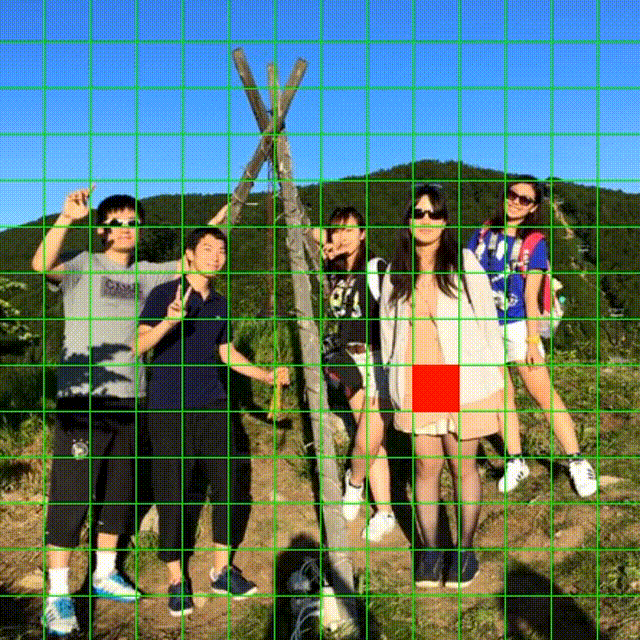

# YOLOv2解説
## FCN(Fully Convolutional Networks)による特徴マップ抽出
通常のCNNでは、最終層に全結合層を入れてsoftmax関数などにかけて、画像のclassificationを行うが、FCNでは、最初から最後まで全てがconvolution層で構築され、特徴マップの精確な位置情報を保持したまま最終層まで伝播される。Semantic Segmentationのタスクでよく用いられるモデルですが、YOLOv2でもこれを導入した事で大幅な精度向上を実現。

## Gridごとにbounding box及びconfidenceを予測
YOLOv2では、入力画像の大きさによって最終層の出力がn x nの特徴マップになるが、これは入力画像をn x nの大きさに分割した時のそれぞれのgridに対応する。各gridは、複数のanchorと呼ばれる一定のアスペクト比のbounding boxを持ち、YOLOv2では各anchorの中心座標(x, y)及び、幅と高さのスケール(w, h)を予測する。更に、各anchor boxはconfidenceと呼ばれるパラメータを持っていて、これはbox内に物体が存在する確率を表す。

この図では各anchor boxの線の太さがconfidenceの高さを表し、最も太線の縦長いanchor boxは、そこに高確率でなにかしらの物体が存在する事を意味している。

同様なanchor boxの予測が全てのgridで行い、そのconfidenceが一定以上(例えば50%)のboxのみをネットワークの出力に用いる。

## bounding boxごとに条件付き確率を予測
各anchor boxは、そこにものが存在するかのconfidenceに加え、もしものが存在するとすれば、それはなんであるかのconditional probability(条件付き確率)も予測するようにしています。
この図では各boxの色がそれぞれのクラスラベルに対応していて、赤色で囲まれているところがhuman、すなわち人間を予測している箇所となります。

## YOLOv2の誤差計算
以上のanchor box、confidence、及び条件付き確率の予測を、YOLOv2では１つのLoss functionに統合しています。もちろん元々別問題だったタスクを1つの誤差関数として逆伝播するので、それぞれの誤差の重みは非常にデリケートですが、学習係数をうまく調整することでend-to-endの学習を可能にしています。

これを分割した状態でも各々訓練可能。

### 条件付き確率の誤差計算

### anchor boxの誤差計算

### confidenceの誤差計算

## dimension cluster
訓練データからk-means法で『最もよく使われるanchor box』を予め決定する手法。YOLOv2ではデフォルトでk=5。これを導入する事で約3〜5%の精度向上を実現。

## darknet19を使った特徴抽出
物体検出のニューラルネットでは、特徴抽出器としてVGG16をベースに事前学習を行うのが一般的だが、YOLOv2ではdarknet19という独自のclassificationモデルを用いる。VGG16とほぼ同等の精度を維持しつつ、計算量を抑えてVGG16の4倍以上高速に動作する。

- VGGと同じくカーネルを3x3とし、pooling層の後でchannel数を2倍にする。
- GoogLeNetと同様に3x3の層の間に1x1の層を入れて次元削減を行う。
- 最後の全結合層を取っ払い、代わりにFCN構造を採用。
- Batch Normalizationを全てのConv層に入れる(betaを使わない)。
- Conv層ではBiasを使わない。Batch Normの後にBias層を入れる(channel単位でBias共有)。
- softmax関数の後、cross entropyの代わりにsum of squared errorを使う。 
- activation関数にreluの代わりにleaky reluを使う。(slope=0.1)
- learning rateについて、初期値0.1で、4乗のPolynomial decay方式で減衰させる。
- NINと同様Global Average pooling層を採用し、入力解像度へ依存しない構造。

## 高解像度と低解像度特徴マップの結合

CNNでは層が深くなるに連れ特徴マップの解像度が落ちるので、より精確なanchor boxの座標予測をするために、YOLOv2では、解像度の高い層からサンプリングした特徴マップを解像度の低い層とチャンネル間で結合している。通常、特徴マップのサイズが合わないとチャンネル間で結合できないが、YOLOv2ではreorganizationという独自の手法を使って、1枚の高解像度の特徴マップを複数の低解像度の特徴マップに再編成する。下図の例では、4 x 4の1channelの特徴マップを、色ごとに別の特徴マップとして切り出し、2 x 2の4channelの低解像度特徴マップに変換する。

## multi-scale training
YOLOv2はFCN構造のため入力画像のサイズは可変。モデル構造をそのままで、学習時に複数サイズの画像を交互に入力する事でロバストなモデルに訓練する(入力画像の32 x 32ピクセルが特徴マップ上の1ピクセルに対応するので、入力画像の幅と高さは必ず32の倍数にする)。

